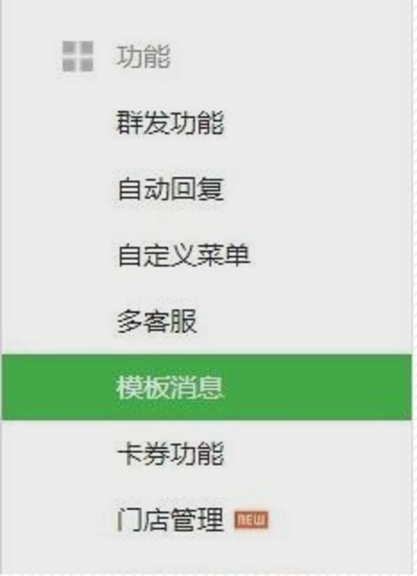
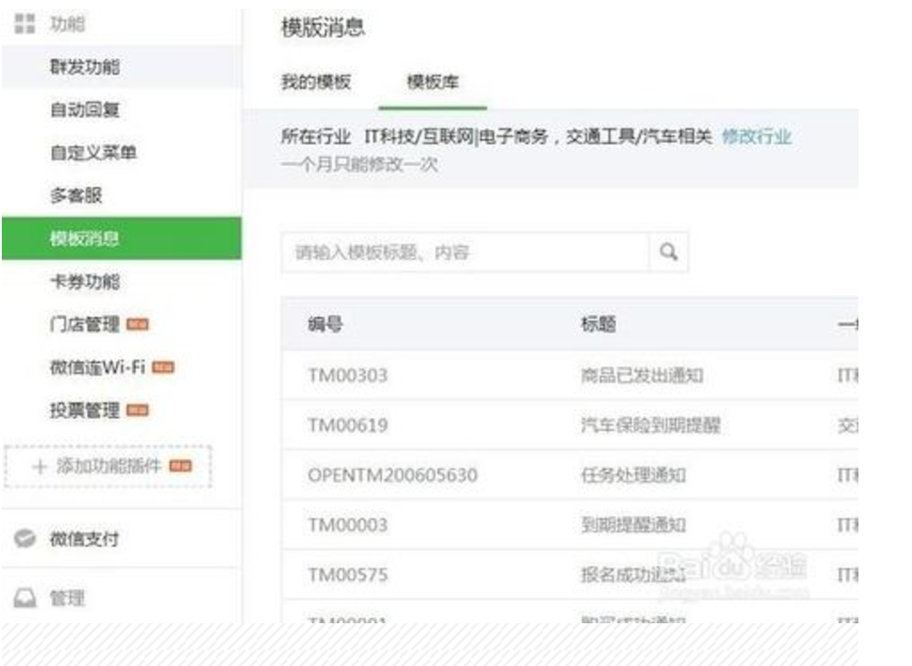
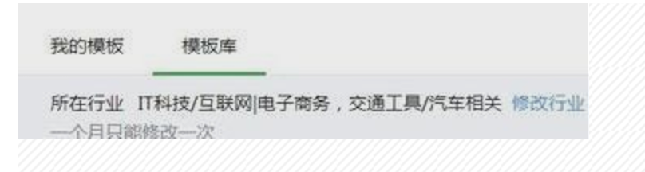
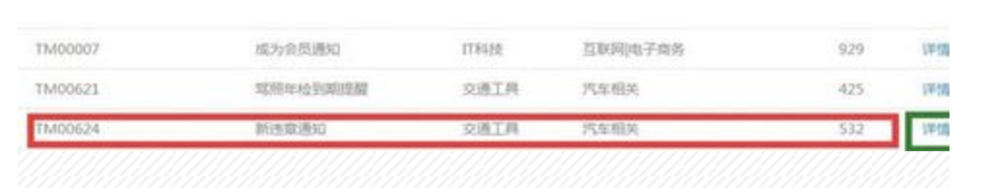
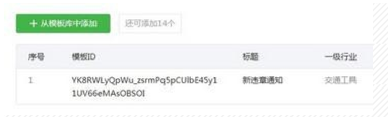

### 微信公众平台添加模板消息功能设置
- 微信公众平台怎么添加设置模板功能，详细讲解如何使用。

#### 工具/原料
- 微信公众号
- 小明跑腿模块

#### 方法/步骤
- 进入自己的微信公众平台，然后在“功能”里面添加“模板消息”功能，如下图所示。

- 然后点击“模板消息”功能，进入模板库，如下图所示，这是以前版本，那么现在版本排版不一样

- 最上面是你微信公众平台所在的行业，你可以自行修改，一个月内只可以修改一次，每个行业的模板功能都不一样，如下图所示

- 然后在下面众多模板中找到自己需要的模板功能，点击“详情”进入，如下图所示。

- 添加成功之后就会显现在你的模板库里面，可以看到对应模板 ID，如下图所示。

- 最后一步填写到跑腿模块模板消息配置输入框内即可!

